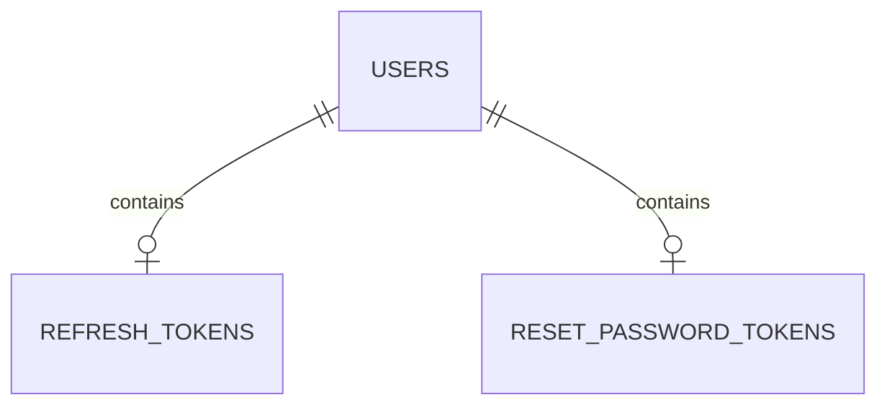

Node JS project for email sending and password recovery

## entity relationship diagram:



## Executing the Project

To run the project, use the following command:

```javascript

    npm run dev
```

## dependencies

-   [Prisma](https://www.prisma.io/)
-   [JWT](https://jwt.io)
-   [BCrypt](https://www.npmjs.com/package/bcrypt)
-   [JsonWebToken](https://www.npmjs.com/package/jsonwebtoken)
-   [tsyringe](https://www.npmjs.com/package/tsyringe)
-   [Celebrate](https://www.npmjs.com/package/celebrate)
-   [DayJs](https://www.npmjs.com/package/dayjs)
-   [Handlebars](https://www.npmjs.com/package/handlebars)
-   [nodemailer](https://www.npmjs.com/package/nodemailer)

<h3 align="center">created by  Delano Almeida filho </h3>
